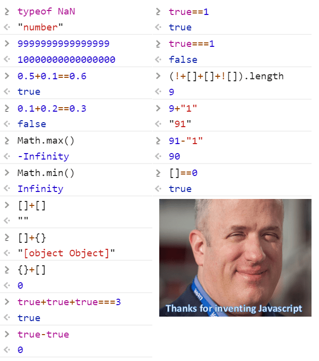

# 스터디 1주차 - 4장 ~ 7장

# 4장 변수

## 4.1 변수란 무엇인가

> **변수**variable 는 하나의 값을 저장하기 위해 확보한 메모리 공간 자체 또는 그 메모리 공간을 식별하기 위해 붙인 이름을 말한다.
> 

변수에 쓰기: **할당assignment, 대입, 저장**

변수를 읽기: **참조reference**

변수 이름은 신중하게 지어야 한다.


[Curioustore](https://www.curioustore.com/)

## 4.2 식별자

*= 변수 이름*

> 어떤 **값**을 구별해서 식별할 수 있는 고유한 이름
> 

## 4.3 변수 선언

변수를 사용하려면 반드시 선언이 필요하다.

ES6 이전: **var**

ES6 이후: **var**, **let**, **const**

```
var 변수는 단점이 많아 사용을 권장하지 않는다. 자세한 내용은 뒷 장에 있다.
```

변수 선언 단계 이후, 해당 변수는 암묵적으로 undefined가 할당되어 초기화된다. 선언한 변수 이름을 비롯한 식별자는 실행 컨텍스트execution context 에 저장된다.

선언되지 않은 변수를 참조하려 할 경우, ReferenceError참조에러 가 발생한다.

## 4.4 변수 선언의 실행 시점과 변수 호이스팅

```
TMI)
MDN에 따르면 ECMAScript 사양에서 호이스팅은 규범적으로 정의된 용어가 아니다.
사양의 HoistableDeclaration에서는 **function**, **function***, **async function**, **async function***의 4개만 포함되어 있다.
단, 호이스팅은 다른 방식이긴 하지만 종종 var의 기능으로 간주되기도 한다. 일반적으로 사용되는 의미로서 '호이스팅'의 동작은 다음과 같다.

**type 1**: 변수가 선언된 줄 이전에 해당 범위에서 변수 값을 사용할 수 있는 경우 ("값 호이스팅")
**type 2**: 변수가 선언된 줄 이전에 해당 범위의 변수를 참조할 수 있지만 ReferenceError를 던지지 않고 값이 항상 정의되지 않음인 경우입니다. ("선언 호이스팅")
**type 3**: 변수를 선언하면 변수가 선언된 줄 앞의 범위에서 동작이 변경됩니다. *("오염")*
**type 4**: 선언의 부작용은 선언이 포함된 나머지 코드를 평가하기 전에 발생합니다.

위의 네 가지 함수 선언은 type 1 동작으로 호출되고, var 선언은 type 2 동작으로 호출됩니다. let, const 및 class 선언(총칭하여 lexical 선언이라고도 함)은 type 3 동작으로 올라갑니다. import 선언은 type 1 및 type 4 동작으로 호출됩니다.

출처: https://developer.mozilla.org/ko/docs/Glossary/Hoisting
```

**이 붙은 함수는 제너레이터 함수로 함수의 실행을 중단했다가 돌아올 수 있는 함수다. (like 코루틴?)*

위와 같은 일이 발생하는 이유는 JS 엔진에서 소스코드를 한줄씩 바로 읽어내리는 것이 아니라 소스코드의 평가 과정을 먼저 거치고 그 이후에 소스코드를 실행하기 때문이다.

## 4.5 값의 할당

> ‘**=**’ assignment
> 

```jsx
var asdf;
asdf = 1;
```

과

```jsx
var asdf =  1;
```

은 완벽하게 동일하게 동작한다. JS에서 변수 선언과 값의 할당의 실행 시점이 다르기 떄문이다.

## 4.6 값의 재할당

> 사실 할당과 동일하다. 어차피 선언과 할당은 별개이기 때문에 undefined를 덮어쓰는것도 결국 재할당이다.
> 

변수는 값을 재할당할 수 있기 때문에 변수이다. 값을 재할당할 수 없다면 **상수**constant 이다. 다른 말로, 상수는 단 한번만 할당할 수 있는 변수다.

> ES6 이상의 const 키워드는 상수를 표현할 수 있다. 그러나 상수만을 위해 사용되지는 않는다.
> 

변수에 값을 재할당하면 변수가 가르키던 메모리를 지우고 다시 할당하는 것이 아니라, 새로운 메모리 공간을 확보하고 그 공간에 새로운 값을 저장한다. 더이상 사용되지 않는 이전 값이 저장된 메모리는 가비지 컬렉터에 의해 자동 해제된다.

```jsx
 > : 식별자가 참조중인 메모리 공간
[ ]: 도달 가능한 메모리 공간
----------------------------
 명령어: var qilip;

메모리a: qilip > [undefined]
메모리b:
메모리c:
----------------------------
 명령어: qilip = 1;

메모리a:          undefined
메모리b: qilip > [    1    ]
메모리c:
----------------------------
 명령어: qilip = 2;

메모리a:          undefined
메모리b:              1
메모리c: qilip > [    2    ]
```

```
TMI)
JS는 매니지드 언어로, 현존하는 (아마)모든 JS 엔진들은 가비지 컬렉터가 메모리를 관리한다.
그러나 ECMAScript 상으로 메모리 관리에 대해 규정된 것은 없다.
```

## 4.7 식별자 네이밍 규칙

> 식별자는 특수문자를 제외한 **문자**, **숫자**, **_**, **$**를 포함할 수 있다.
단, 식별자는 특수문자를 제외한 **문자**, **_**, **$**로 시작해야 한다. (숫자는 허용하지 **않**는다)
예약어는 식별자로 사용할 수 **없**다.
> 

따라서 유니코드 문자는 식별자로 사용할 수 있다.

```jsx
const 안녕하세요 = '안녕하세요';
console.log(안녕하세요); // 안녕하세요
```

자바스크립트의 변수명은 대소문자를 구분한다. 이제는 대소문자 비구분 언어가 더 특이하기는 하다.

예약어 (책 내용):

| await | break | case | catch | class | const |
| --- | --- | --- | --- | --- | --- |
| continue | debugger | default | delete | do | else |
| enum | export | extends | false | finally | for |
| function | if | implements* | import | in | instanceof |
| interface* | lef* | new | null | package* | private* |
| protected* | public* | return | super | static* | switch |
| this | throw | true | try | typeof | var |
| void | while | with | yield* |  |  |

`*` 의 경우 식별자로 사용 가능하나 strict mode에서는 사용 불가

위 표에서 빠져있듯, async와 같은 일부 키워드는 사용이 가능하다.

```jsx
var async = 2;
console.log(async); // 2
```

TypeScript에서는 조금 더 세분화되어 있다. Contextual Keywords는 문맥에 따라 다른 경우를 말한다.

| Reserved Words | Strict Mode Reserved Words | Contextual Keywords |
| --- | --- | --- |
| break | as | any |
| case | implements | boolean |
| catch | interface | constructor |
| class | let | declare |
| const | package | get |
| continue | private | module |
| debugger | protected | require |
| default | public | number |
| delete | static | set |
| do | yield | string |
| else | symbol |  |
| enum | type |  |
| export | from |  |
| extends | of |  |
| false |  |  |
| finally |  |  |
| for |  |  |
| function |  |  |
| if |  |  |
| import |  |  |
| in |  |  |
| instanceof |  |  |
| new |  |  |
| null |  |  |
| return |  |  |
| super |  |  |
| switch |  |  |
| this |  |  |
| throw |  |  |
| true |  |  |
| try |  |  |
| typeof |  |  |
| var |  |  |
| void |  |  |
| while |  |  |
| with |  |  |

출처: [https://github.com/microsoft/TypeScript/issues/2536#issuecomment-87194347](https://github.com/microsoft/TypeScript/issues/2536#issuecomment-87194347)

변수 네이밍 컨벤션 : 자바스크립트에서의 일반적인 네이밍 사용처

카멜 케이스 `camelCase` : 변수명, 함수명

스네이크 케이스 `snake_case` 

파스칼 케이스 `PascalCase` : 클래스명

헝가리안 케이스 `typeHungarianCase`

# 5장 표현식과 문

## 5.1 값

> **값**value은 **식**(표현식expression)이 **평가**evaluate되어 생성된 결과를 말한다.
> 

모든 값은 데이터 타입을 가지며 메모리에 비트의 나열로 저장된다.

변수는 하나의 값을 저장하기 위해 확보한 메모리 공간 자체 또는 그 메모리 공간을 식별하기 위해 붙인 이름이다. 따라서 변수에는 값이 할당된다.

## 5.2 리터럴

> **리터럴**literal은 사람이 이해할 수 있는 문자 또는 약속된 기호를 사용해 값을 생성하는 **표기법**notation을 말한다.
> 

| 리터럴 | 예 |
| --- | --- |
| 부동소수점 | 10.5 |
| 2진수 (0b) | 0b0101 |
| 8진수 (0o, ES6) | 0o1010 |
| 16진수 (0x, ES6) | 0x0101 |
| 문자열 | ‘qilip’
”QILIP” |
| 불리언 | true
false |
| null | null |
| undefined | undefined |
| 객체 | { name: ‘qilip’, age: 99999999 } |
| 배열 | [ 1, 2, 3, 4 ] |
| 함수 | function() { … } |
| 정규 표현식 | /[가-힣]+/g |

## 5.3 표현식

> **표현식**expression은 값으로 평가될 수 있는 **문**statement이다. 즉, 표현식이 평가되면 새로운 값을 생성하거나 기존 값을 참조한다.
> 

```jsx
10 // 리터럴 표현식

const sum;
sum // 식별자 표현식

10 + 20 // 연산자 표현식

function asdf() {...}
asdf() // 함수/메서드 호출 표현식
```

표현식은 값으로 평가되고, 표현식과 표현식이 평가된 값은 **동치**equivalent다.

따라서 숫자로 평가될 수 있는 표현식이라면 숫가 값 대신 사용할 수 있다.

```jsx
let x = 1 + 2; // ok
x + 3; // = 6, ok
```

## 5.4 문

> **문**statement은 프로그램을 구성하는 기본 단위이자 최소 실행 단위다.
> 

문은 여러 토큰으로 구성된다. **토큰**token이란 문법적인 의미를 가지며, 문법적으로 더 이상 나눌 수 없는 코드의 기본 요소이다.

문: `var sum = 1 + 2;`

토큰: `var` , `sum` , `=` , `1` , `+` , `2` , `;`

문은 선언문(`var`), 할당문(`=`), 조건문(`if`), 반복문(`for`) 등으로 구분할 수 있다.

## 5.5 세미콜론과 세미콜론 자동 삽입 기능

*Automatic semicolon insertion*

자바스크립트에서 문의 끝에 붙이는 세미콜론은 선택 사항이다. 대부분의 상황에서는 세미콜론 자동 삽입 기능ASI가 적절하게 세미콜론을 삽입해준다.

그러나 일부 상황에서는 세미콜론 자동 삽입 기능이 예상과 다르게 동작할 수 있다.

```jsx
function asd() {
	return
		{}
}
// ASI => return; {};
// we want => return {};

const qwe = function () {}
(function() {})();
// ASI => ... function () {}(function() ...
// we want => ... function () {}; (function() ...
```

통상적인 코딩 컨벤션 상황에서는 ASI가 정상적으로 작동하기 때문에 불필요한 세미콜론을 붙이지 말아야 한다는 주장과, 확실한 문의 끝을 나타내기 위해 세미콜론을 붙여야 한다는 주장이 있다.

```
TMI)
개인적인 생각으로는, 프론트 계열이 세미콜론을 붙이지 않는 것 같다. (Nuxt의 기본 스타일 등)
백엔드 계열은 대부분 붙이는 것을 선호했던 것 같다. (Nest 등)
```

## 5.6 표현식인 문과 표현식이 아닌 문

> 변수에 할당 가능하면 표현식인 문이고, 그렇지 않으면 표현식이 아닌 문이다
> 

```jsx
let qp = var lol; // SyntaxError
```

크롬 개발자 도구에서 표현식이 아닌 문을 실행할때 반환되는 undefined는 완료 값으로, 표현식의 평가 결과가 아니다. 따라서 활용될 수 없다.

크롬 개발자 도구에서 표현식인 문을 실행하면 평가된 값을 반환한다.

# 6장 데이터 타입

***데이터 타입**data type, 값의 종류*

| 구분 | 데이터 타입 | 설명 |
| --- | --- | --- |
| 원시 타입primitive type | 숫자number |  |
| 원시 타입 | 문자열string |  |
| 원시 타입 | 불리언boolean | 논리 true, false |
| 원시 타입 | undefined | var 변수의 암묵적 할당값 |
| 원시 타입 | null | 값이 없다는걸 명시할때 사용 |
| 원시 타입 | 심벌symbol | ES6 |
| 원시 타입 | BigInt | ES11, 2^53-1보다 큰 정수 표현 |
| 객체 타입object/reference type |  | 객체, 함수, 배열, … |

## 6.1 숫자 타입

C나 JAVA와 다르게 자바스크립트는 기본적으로 하나의 숫자 타입을 사용한다.

ECMAScript 사양에서, 숫자 타입은 **배정밀도 64비트 부동소수점** 형식을 사용한다. 숫자를 특정한 진법으로 표현하더라도 모두 같은 숫자로 취급한다

```jsx
0o101 === 0x41 // true
```

```
TMI)
크롬 V8 내부적으로는 최적화를 위해 작은 정수 (64비트: ~2^31-1, 32비트: ~2^30-1)들은 SMIS(**SM**all **I**nteger**S**)로 특별하게 처리한다. 이외에도 다양한 요소 유형이 존재한다.

V8 내부에서 대부분의 값은 포인터로 관리된다. SMIS 같은 일부를 제외하면 대부분 참조로 이루어진다.

https://v8.dev/blog/elements-kinds
```

숫자 타입은 다음의 특별한 값도 표현한다.

`Infinity` : 양의 무한대

`-Infinity` : 음의 무한대

`NaN` : 산술 연산 불가 (**N**ot-**a**-**N**umber)

자바스크립트에서는 대소문자를 구분하기 때문에 NaN을 NAN, Nan, nan 등으로 표현하면 식별자로 해석하기 때문에 오류가 발생한다.

## 6.2 문자열 타입

문자열은 0개 이상의 16비트 유니코드 (UTF-16)의 집합이다.

```jsx
let str;
str = 'is string!'; // 작은따옴표
str = "IS STring..."; // 큰따옴표
str = `백 틱 문자열!`; // ES6 백틱
str = '작은따옴표 안의 "큰따옴표"는 문자열이에요!';
str = "반대도 '동일' 하답니다.";
```

C는 문자의 배열로 문자열을 표현하고, JAVA는 문자열을 객체로 표현하지만 자바스크립트의 문자열은 원시 타입이고 변경 불가능한 값immutable value 이다.

```
TMI) V8 내부에서 문자열은 string table을 통해 해시하 관리한다. 따라서 같은 문자열을 열심히 복사해도 메모리를 복사한 만큼 차지하지는 않는다.

let a = 'str'; 이 let b = new String('str'); 보다 효율적이다.
동일하게 string table로 관리되지만, 후자는 불필요하게 객체를 생성하기 때문이다.

https://chromium.googlesource.com/v8/v8/+/refs/heads/main/src/objects/string-table.h

```

## 6.3 템플릿 리터럴

백틱을 사용해서 표현하는 문자열로, 다양한 기능을 제공한다.

```jsx
const newstr = `중간에 개
행을
한
다 던가`;
const oldstr = '일반적으로는\n개행문자를';

// 표현식 삽입expression interpolation
const myName = 12+34; // 평가 결과가 문자열이 아니어도 문자열로 강제 변환됨
const oldadd = '제 이름은 ' + myName + ' 입니다.'; // 제 이름은 46 입니다.
const newadd = `제 이름은 ${myName} 입니다.`;
```

## 6.4 불리언 타입

`*true` or `false`*

## 6.5 undefined 타입

> undefined
> 

## 6.6 null 타입

undefined를 직접 할당하는것은 undefined의 의도와 어긋난다. 따라서 값이 없다는걸 표현할때는 null을 사용한다.

Null, NULL은 null이 아니다.

## 6.7 심벌 타입

심벌 값은 다른 값과 중복되지 않는 유일무이한 값이다. 리터럴을 통해 생성되지 않고 Symbol 함수를 호출해 생성한다.

```jsx
let key = Symbol('key');
let obj;
obj[key] = 'asdf';
```

## 6.8 객체 타입

> 11장에 있기에 알려주지 않겠다.
*To be continued…*
> 

## 6.9 데이터 타입의 필요성

- 데이터 타입마다 차지할 공간이 다름
- 메모리에서 한번에 읽을 단위를 결정함
- 메모리에서 읽은 바이너리 값을 어떻게 해석할지 결정함

## 6.10 동적 타이핑


*stronly - 암묵적 변환 없음, dynamically - 변수에 아무 타입 할당 가능*

> 자바스크립트의 변수는 선언이 아닌 할당에 의해 **타입 추론**type inference된다. 그리고 재할당에 의해 변수의 타입은 동적으로 변할 수 있다. (**동적 타이핑**dynamic typing)
> 

자바스크립트는 **동적 타입**dynamic/weak type 언어다.

~~타입스크립트 쓰자~~

# 7장 연산자

> **연산자**operator는 하나 이상의 표현식을 대상으로 산술, 할당, 비교, 논리, 타입, 지수 연산operation 등을 수행해 하나의 값을 만든다. 이때 연산의 대상을 **피연산자**operand라 한다.
> 

## 7.1 산술 연산자

*수학 + 수학 = 수학; 수학 + 나 = NaN;*

### 이항 산술 연산자

`피연산자` `연산자` `피연산자`

| 이항 산술 연산자 | 의미 | 부수 효과side effect |
| --- | --- | --- |
| + | 더해요 | X |
| - | 빼요 | X |
| * | 곱해요 | X |
| / | 나눠요 | X |
| % | 남은거 | X |

### 이항 산술 연산자

`피연산자` `연산자` or `연산자` `피연산자`

| 이항 산술 연산자 | 의미 | 부수 효과side effect |
| --- | --- | --- |
| ++ | 하나 늘어요 | O |
| — | 하나 줄어요 | O |
| + | 아무것도 안하고 숫자로 반환해요 | X |
| - | 음→양, 양→음 반전해서 반환해요 | X |

```jsx
const x = 0;
// postfix increment operator
const zro = x++; // 0 1
// prefix increment operator
const two = ++x; // 2 2
// postfix decrement operator
const tto = x--; // 2 1
// prefix decrement operator
const zzo = --x; // 0 0

const t = true;
const one = +t; // 1

const hello = 'HELLO';
const nan = +hello; // NaN
```

### 문자열 연결 연산자

`+` 연산자는 피연산자 중 하나 이상이 문자열인 경우 문자열 연결 연산자로 동작한다.

```jsx
1 + '2'; // '12'
'1' + 2; // '12'
```

## 7.2 할당 연산자

> **할당 연산자**assignment operator는 우항에 있는 피연산자의 평가 결과를 좌항에 있는 변수에 할당한다.
> 

`=` , `+=` , `-=` , `*=` , `/=` , `%=`

할당문은 할당된 값으로 평가되는 표현식인 문이다.

```jsx
var a, b, c, d, e;
a = b = c = d = e = 0; // ok
```

## 7.3 비교 연산자

### 동등/일치 비교 연산자

| 비교 연산자 | 의미 | 설명 |
| --- | --- | --- |
| == | 동등 비교 | 값이 같음 |
| === | 일치 비교 | 값과 타입이 같음 |
| != | 불동등 비교 | 값이 다름 |
| !== | 불일치 비교 | 값과 타입이 다름 |

```jsx
5 == '5'; // true
5 === '5'; // false
```



결론: === 쓰자

```jsx
//주의
// JS에서는 NaN과 NaN은 다릅니다
NaN === NaN; // false
// JS에는 사실 -0과 +0이 있습니다
0 === -0; // true

// 이걸 쓰세요
Number.isNaN(NaN); // true
Number.isNaN(1 + undefined); // true
//
Object.is(-0. +0); //false
Object.is(NaN, NaN); // true
```

### 대소 관계 비교

`> < >= <=` *다 알죠?*

## 7.4 삼항 조건 연산자

`결과` = `조건이` ? `true로 평가될때 실행` : `아닐때 실행` ;

삼항 연산자 표현식은 `if else`와 다르게 값처럼 사용할 수 있다.

## 7.5 논리 연산자

 OR `||` , AND `&&` , NOT `!`

```jsx
'a' || 'b'; // 'a'
'c' && 'd'; // 'd'
```

*process.env.NODE_ENV || 'developement'*

## 7.6 쉼표 연산자

왼쪽 피연산자부터 차례대로 평가하고 마지막 피연산자의 평가 결과를 반환

```jsx
x = 1, y = 2, z = 3; // 3
```

## 7.7 그룹 연산자

*전문용어로 가로*

소괄호 `()` 로 감싸면 가장 먼저 평가된다.

## 7.8 typeof 연산자

> 피연산자의 데이터 타입을 문자열로 반환한다
> 

`string` , `number` , `boolean` , `undefined` , `symbol` , `object` , `function` 중 하나를 반환한다.

`null` 문자열 반환은 없다.

```jsx
typeof null // "object"
```

~~유사언어의 증거~~

typeof null의 결과는 **“object”**로, 이는 자바스크립트 첫 버전의 버그이나 호환성을 위해 유지되었다.

```jsx
// 따라서 null 타입 여부는 다음과 같이 판단한다
var x = null; // if x is null...
x === null; // true
```

또한, typeof 연산자로 선언하지 않은 식별자를 연산하면 ReferenceError가 아닌 undefined를 반환한다.

```jsx
// thiSiSundeclareD
typeof thiSiSundeclareD; // "undefined"
console.log(thiSiSundeclareD); // ReferenceError
```

## 7.9 지수 연산자

*Math.pow야 잘가*

> ES7에서 도입, 좌항의 피연산자를 **밑**base로, 우항의 피연산자를 **지수**exponent로 거듭 제곱하여 숫자 값을 반환한다.
> 

```jsx
2 ** 2; // 4
2 ** 0; // 1

Math.pow(2, 2); // 4

-2 ** 2; // SyntaxError
(-2) ** 2; // 4

let a = 2;
a **= 2; // 4
```

지수 연산자는 이항 연산자 중 우선순위가 가장 높다.

```jsx
2 * 5 ** 2; // 50
```

## 7.10 그 외의 연산자

> *그 내용들은 뒤에 두고왔따*
> 

## 7.11 연산자의 부수 효과

*다들 알거라 믿어요*

## 7.12 연산자 우선순위

*당신의 코드를 읽는 사람이 우선순위를 외웠을거라 생각하지 말아주세요*


[https://developer.mozilla.org/ko/docs/Web/JavaScript/Reference/Operators/Operator_precedence](https://developer.mozilla.org/ko/docs/Web/JavaScript/Reference/Operators/Operator_precedence)
