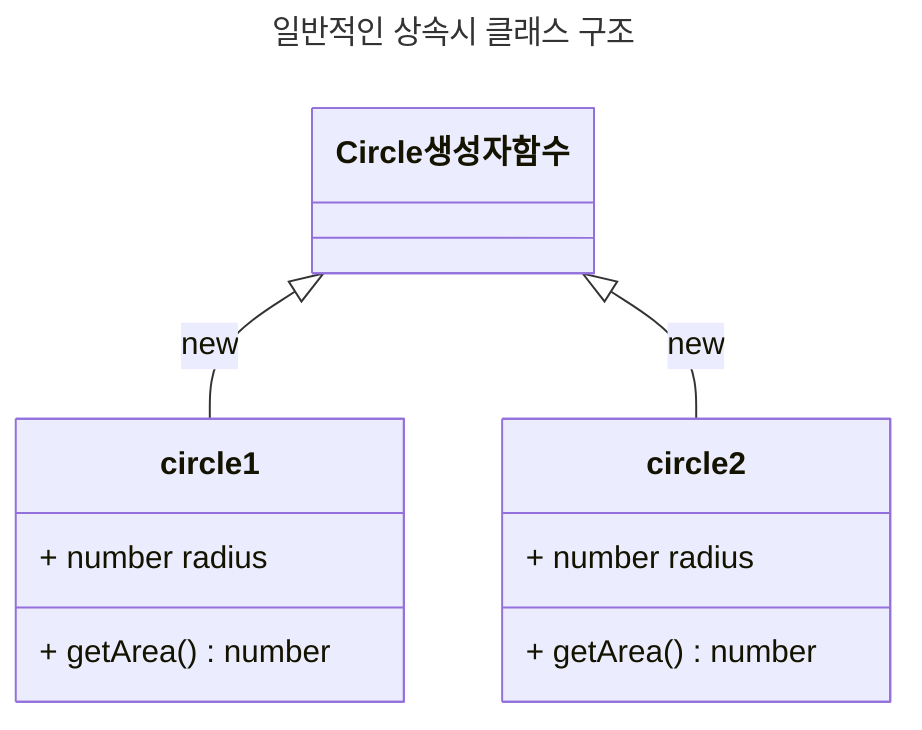
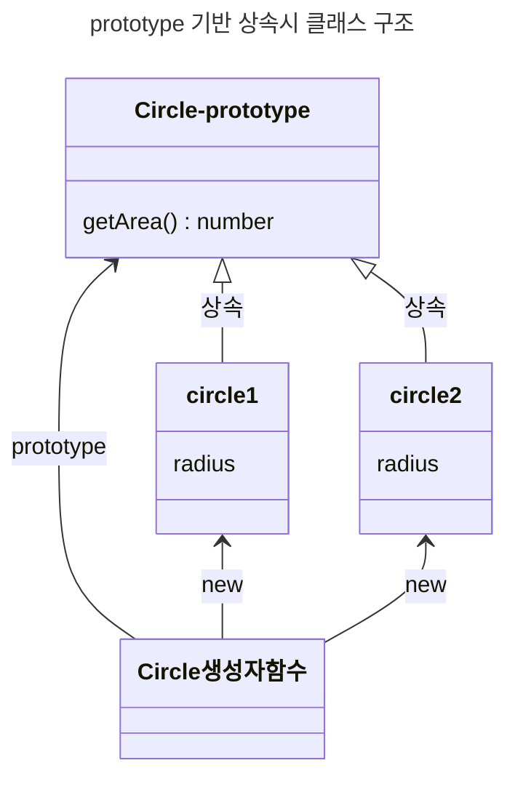
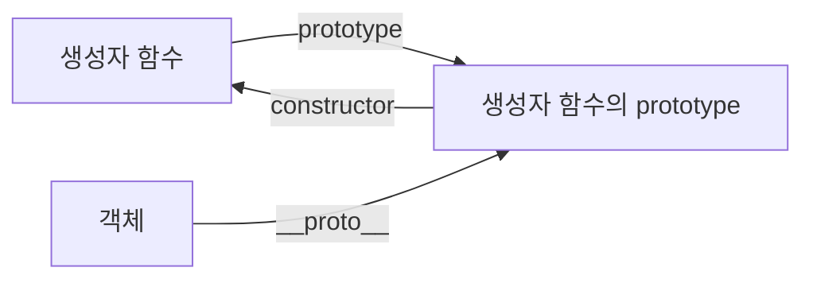
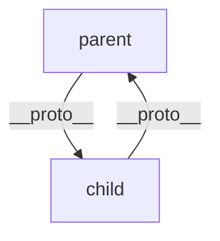
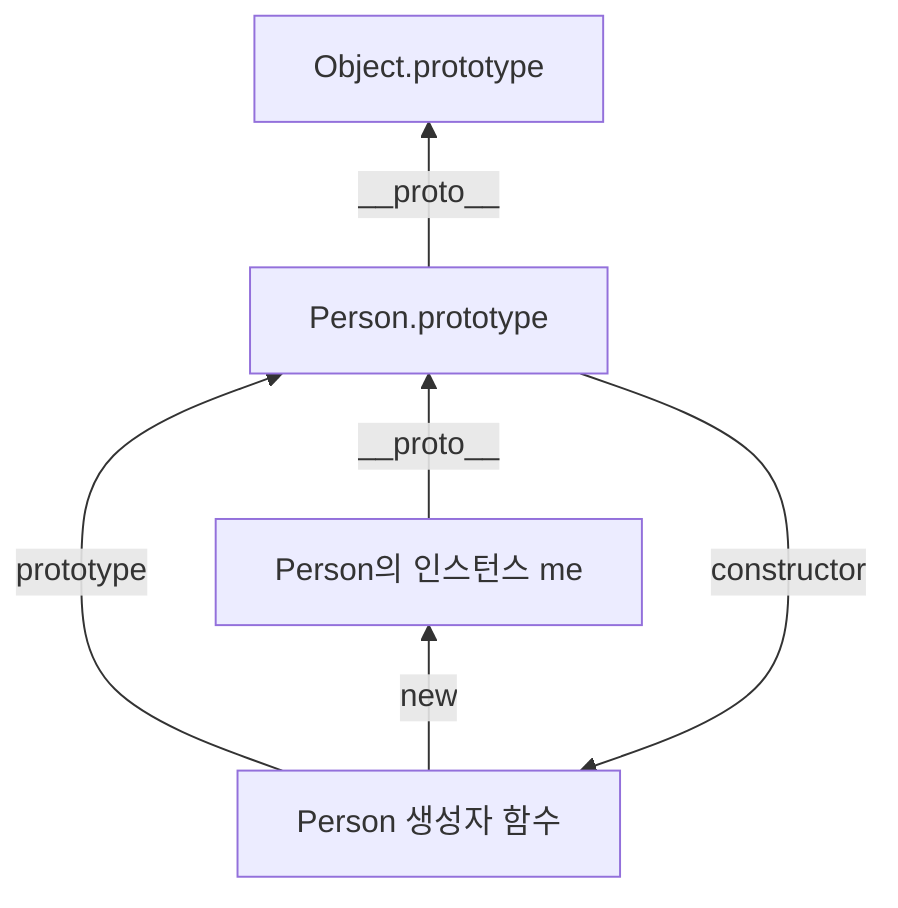
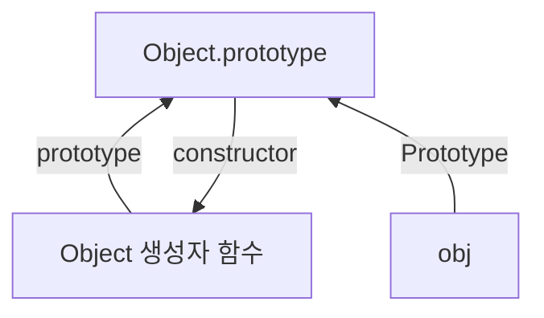
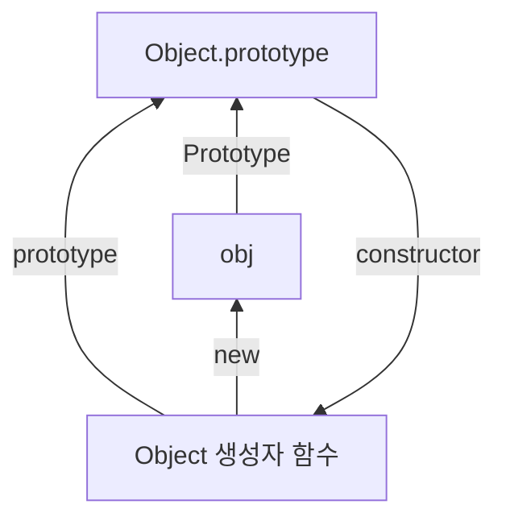
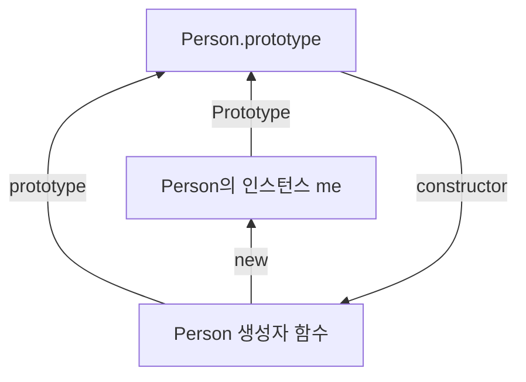
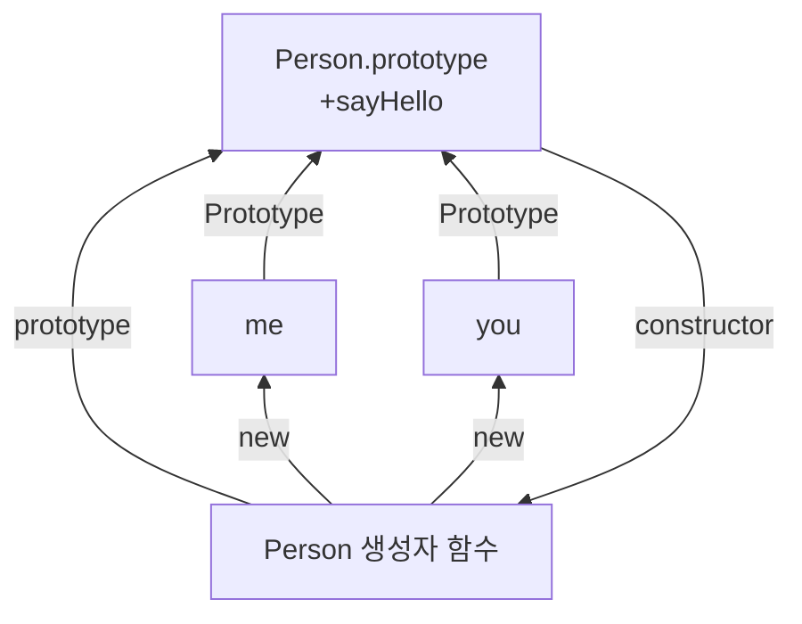

# 17. 생성자 함수에 의한 객체 생성
> [[10. 객체 리터럴]] 이외에도 다양한 방법으로 객체를 생성하는 방법 

## 17.1 Object 생성자 함수 

- `new Object()` 를 호출하면 빈 객체를 생성할 수 있다. 
- 특별한 이유가 없다면 그다지 유용하지 않은 방법

## 17.2 생성자 함수 
### 17.2.1 객체 리터럴에 의한 객체 생성 방식의 문제점 
- 객체 리터럴은 동일한 프로퍼티를 갖는 객체를 여러개 생성하기 때문에 비효율적. 
### 17.2.2 생성자 함수에 의한 객체 생성 방식의 장점 
- 프로퍼티 구조가 동일한 객체 여러 개를 간편하게 생성할 수 있다.
``` javascript
// 생성자 함수
function Circle (radius) {
	// 생성자 함수 내부의 this는 생성자 함수가 생성할 인스턴스를 가리킨다.
	this radius = radius;
	this.getDiameter = function () {
		return 2 * this.radius;
	};
}

// 인스턴스의 생성
const Circle1 = new Circle(5); // 반지름이 5인 CircLe 객체를 생성 
const circle2 = new Circle(10); // 반지름이 10인 Circle 객체를 생성
console.log(circle1.getDiameter()); // 10
console.log(circle2.getDiameter()); // 20
```

- `new` 키워드 없이 호출하게 되면 일반 함수로 동작한다....?
``` javascript
// new 연산자와 함께 호출하지 않으면 생성자 함수로 동작하지 않는다.
// 즉, 일반 함수로서 호출된다.
const circle3 = Circle(15);

// 일반 함수로서 호출된 CircLe은 반환문이 없으므로 암묵적으로 undefined를 반환한다.
console.log(circle3); // undefined

// 일반 함수로서 호출된 Circle 내의 this는 전역 객체를 가리킨다.
console.log(radius); // 15

```

### 17.2.3 생성자 함수의 인스턴스 생성 과정 
> `new Circle()` 는 어떻게 동작하는 걸까 

#### 1. 인스턴스 생성과 this 바인딩 
- 암묵적으로 빈 객체가 생성된다. (향후 인스턴스로 사용된다)
- 생성된 빈 객체가 `this`에 바인딩된다. 

#### 2. 인스턴스  초기화 
- 생성자 함수의 코드가 실행되며 `this`에 바인딩되어 있는 인스턴스를 초기화 

#### 3. 인스턴스 반환 
- 생성자 함수 내부의 모든 처리가 끝나면 `this`가 암묵적으로 반환된다.
- 만약 다른 객체를 명시적으로 반환하면 해당 객체가 반환된다.
``` javascript
function Circle(radius) {
	// 1. 암묵적으로 빈 객체가 생성되고 this에 바인딩된다.
	// 2. this에 바인딩되어 있는 인스턴스를 초기화한다.
	this.radius = radius;
	this getDiameter = function () {
		return 2 * this.radius;
	}

	// 3. 암묵적으로 this를 반환한다.
	// 명시적으로 객체를 반환하면 this 반환이 무시된다.
	return {};
	
	// 명시적으로 원시 값을 반환하면 원시 값 반환은 무시되고 암묵적으로 this가 반환된다.
	return 100;
}
```

### 17.2.4 내부 메소드 \[\[Call]]과 \[\[Construct]]
> 함수 객체는 일반 객체와 다르다. 

- 함수 객체는 호출될 수 있다.
- 이를 구별하기 위해 **내부 슬롯과 메소드**를 추가로 가지고 있다.
	- 내부 메소드 : `[[Call]]` , `[[Construct]]`
	- 내부 슬롯 : `[[Environment]]`, `[[FormalParameters]]` 등 
- 일반 함수로서 호출되면 `[[Call]]`, 생성자 함수로서 호출되면 `[[Construct]]` 수행

### 17.2.5 constructor와 non-constructor의 구분 
> 할당 위치가 아닌 **함수 정의 방식**에 따라 구분할 수 있다. 

- `constructor` : 함수 선언문, 함수 표현식,클래스 
- `non-constructor` : 메소드([[10. 객체 리터럴#10.9.3 메소드 축약 표현|메소드 축약 표현]]만 해당), 화살표 함수

#### 17.2.6 new 연산자
> `new` 연산자와 함께라면 생성자 함수로 사용될 수 있다. 

- `constructor` 인 함수는, `new` 연산자와 함께 호출되면 `[[Construct]]`가 호출. 
``` javascript
// 생성자 함수로서 정의하지 않은 일반 함수
function add (x, y) {
	return x + y;
}

// 생성자 함수로서 정의하지 않은 일반 함수를 new 연산자와 함께 호출
let inst = new add();

// 함수가 객체를 반환하지 않았으므로 반환문이 무시된다. 따라서 빈 객체가 생성되어 반환된다.
console.log(inst); // {}

// 객체를 반환하는 일반 함수
function createUser (name, role) { 
	return { name, role };
｝

// 일반 함수를 new 연산자와 함께 호출
inst = new createUser('Lee', 'admin');

// 함수가 생성한 객체를 반환한다.
console.log(inst); // {name: "Lee", role: "admin"}
```

### 17.2.7 new.target 
> 생성자 함수를 `new` 와 함께 호출되는 것을 강제하는 수단 


-  생성자 함수가 `new` 연산자 없이 호출되는 것을 방지하기 위해 PascalCase 컨벤션을 사용한다.
	- 그래도, 누군가는 `new` 없이 호출할 것이다.

- `ES6`은 `new.target`을 이용해서 강제화
	- `new` 없이 호출된 생성자 : `new.target === undefined`
	- `new` 와 함께 호출된 생성자 : `new.target !== undefined`
- 따라서, `new.target` 이 `undefined` 이라면 `new` 와 함께 재호출한다.
``` javascript
// 생성자 함수
function Circle(radius) {
	// 이 함수가 new 연산자와 함께 호출되지 않았다면 new. target은 undefined다.
	if (new.target) {
		// new 연산자와 함께 생성자 함수를 재귀 호출하여 생성된 인스턴스를 반환한다.
		return new Circle(radius);
	}
	this.radius = radius;
	this.getDiameter = function () {
		return 2 * this. radius;
	}
};

const circle = Circle(5);
console.log(circle.getDiameter());
```

- 우리 `IE` 에서는 `new.target`을 이용할 수 없는데, `Scope-safe constructor` 패턴을 사용할 수 있다. 
``` javascript
// Scope-Safe Constructor Pattern
function Circle(radius) {
	if (!(this instanceof Circle)) {
		return new Circle(radius);
	}
	this.radius = radius;
	this.getDiameter = function () {
		return 2 * this. radius;
	};
}
```


# 18. 함수와 일급 객체

## 18.1 일급 객체 

1. 무명의 리터럴로 생성할 수 있다.
2. 변수나 자료구조에 저장할 수 있다.
3. 함수의 매개변수에 전달할 수 있다.
4. 함수의 반환값으로 사용할 수 있다. 

## 18.2 함수 객체의 프로퍼티 
> 함수도 프로퍼티를 가질 수 있다! 

- [console.dir](https://developer.mozilla.org/en-US/docs/Web/API/console/dir_static) : 객체의 프로퍼티를 볼 수 있는 명령어 
	- `arguments`, `caller`, `length`, `name` ,`prototype`

### 18.2.1 arguments
> 함수 호출 시 전달된 인수들의 정보를 담고 있는 **유사 배열 객체** 

- `Function.arguments`와 같이 접근할 수 있지만,  ES3부터 표준에서 폐지되었음. 
- `arguments` 객체를 참조하여 사용하는 것을 추천
``` javascript
muliply()
[Arguments] {}

muliply(1)
[Arguments] { '0': 1 }

muliply(1, 2)
[Arguments] { '0': 1, '1': 2 }

muliply(1, 2, 3)
[Arguments] { '0': 1, '1': 2, '2': 3 }

muliply(1, 2, 3, 4)
[Arguments] { '0': 1, '1': 2, '2': 3, '3': 4 }
```

- 가변 인자 함수를 구현할 때 유용하다.
- 유사 배열이기 떄문에 배열의 메소드를 직접 호출할 수는 없다. ([[22. this]], [[27. 배열]])
#### arguments 객체의 Symbol.iterator 
- `arguments` 객체를 순회 가능한 자료구조로 만들기 위한 프로퍼티
``` javascript
function multiply(x, y) {
	// 이터레이터
	const iterator = arguments [Symbol.iterator]();
	
	// 이터레이터의 next 메서드를 호출하여 이터러블 액체 arguments를 순회
	console.log(iterator.next()); // {value: 1, done: false} 
	console.log(iterator.next()); // {value: 2, done: false} 
	console.log(iterator.next()); // {value: 3, done: false} 
	console. log(iterator.next)); // {value: undefined, done: true}
	return x * y;
}
multiply(1, 2, 3);
```


### 18.2.2 caller 
> ECMA 사양에 포함되지 않은 비표준 프로퍼티, 표준화될 예정도 없다. 

- 자기 자신을 호출한 함수를 가리킨다.
### 18.2.3 length 
> 함수를 정의할 때 선언한 매개변수의 개수를 가리킨다

- `arguemnts` 객체의 `length` 는 **인자의 개수** 
- `length` 프로퍼티는 **매개 변수의 개수**

``` javascript
function muliply(x, y) {
	console.log(`arguments.length: ${arguments.length}`)
	return x * y;
}
```

```
muliply()
arguments.length: 0

muliply(1)
arguments.length: 1

muliply(1, 2)
arguments.length: 2

muliply(1, 2, 3)
arguments.length: 3

muliply(1, 2, 3, 4)
arguments.length: 4

2 // multiply.length
```

### 18.2.4 name 프로퍼티
> ES6에서 정식 표준으로 올라온 프로퍼티

- 익명 함수의 `name` 프로퍼티는 ES5/ES6에 대해서 동작이 각각 다르다.
	- ES5 : 빈 문자열
	- ES6 : 식별자 객체([[12. 함수#12.4 함수 정의|함수 식별자의 의미]])

### 18.2.5 \_\_proto\_\_ 접근자 프로퍼티
> 상속을 구현하는 객체, `[[Prototype]]`

- 모든 타입은 `[[Prototype]]` 이라는 내부 슬롯를 가지고 있다. 
- `__proto__` 는 `[[Prototype]]` 내부 슬롯이 가리키는 객체에 접근하기 위해 사용되는 **접근자 프로퍼티**
``` javascript
const obj = { a: 1 };

// 객체 리터럴 방식으로 생성한 객체의 프로토타입 객체는 0bject.prototype이다.
console.log(obj.__proto__ === Object.prototype) // true 

// 객체 리터럴 방식으로 생성한 객체는 프로토타입 객체인 Object.prototype의 프로퍼티를 상속받는다.
// hasOwnProperty 메서드는 0bject.prototype의 메서드다.
console.log(obj.hasOwnProperty('a'));

// true
console.log(obj.hasOwnProperty('__proto__')); // false
```

### 18.2.6 prototype 
> `contructor` 만이 소유하는 프로퍼티 

# 19. 프로토타입

- JS는 **명령형**, **함수형**, **프로토타입 기반**, **객체지향**을 지원하는 멀티 패러다임 언어이다.
- 객체지향보다 더 강력한 객제지향 능력을 지니고 있는 프로토타입 기반의 언어
- `class`는 프로토타입 기반의 문법을 제공하는 `Syntactic Sugar`

## 19.1 객체지향 프로그래밍 
- 객체의 집합으로 프로그램을 표현하려는 프로그래밍 패러다임 
- **추상화**: 다양한 속성 중 특정 속성에만 관심을 갖는 것 
- 객체의 상태와 동작을 하나의 논리적인 단위로 묶어 생각하는 것 

## 19.2 상속과 프로토타입 

- 상속 : 어떤 객체의 프로퍼티 또는 메소드를 다른 객체가 상속받아 사용하는 것. 
	- 이는, 동일한 메소드를 인스턴스마다 할당받기 때문에 비효율적인 측면이 있음. 
- JS는 프로토타입을 기반으로 상속을 구현함
``` javascript
// 생성자 함수
function Circle(radius) {
	this.radius = radius;
}
// CircLe 생성자 함수가 생성한 모든 인스턴스가 getArea 메서드를 
// 공유해서 사용할 수 있도록 프로토타입에 추가한다.
// 프로토타입은 CircLe 생성자 함수의 prototype 프로퍼티에 바인딩되어 있다.
Circle.prototype.getArea = function () {
	return Math. PI * this.radius ** 2;
}
// 인스턴스 생성
const circle = new Circle(1);
const circle2 = new Circle(2);
```






## 19.3 프로토타입 객체 
- **프로토타입**: 어떤 객체의 상위(부모) 객체의 역할을 하는 객체
- 모든 객체는 `[[Prototype]]` 이라는 내부 슬롯을 가지며, 이 값은 프로토타입의 참조다.
- `[[Prototype]]`의 값은 객체 생성 방식에 따라 결정된다. ([[19. 프로토타입#19.6 객체 생성 방식과 프로토타입의 결정|19.6절 참조]])
- `__proto__` 접근자를 통하여 `[[Prototype]]` 의 값에 접근할 수 있다.

- 프로토타입은 자신의 `constructor` 프로퍼티를 통해 생성자 함수에 접근할 수 있고, 
- 생성자 함수는 자신의 `prototype` 프로퍼티를 통해 프로토타입에 접근할 수 있다. 

### 19.3.1 \_\_proto\_\_ 접근자 프로퍼티

- 모든 객체는 `__proto__` [[16. 프로퍼티 어트리뷰트#16.3.2 접근자 프로퍼티|접근자 프로퍼티]]를 통해 자신의 프로토타입에 접근할 수 있다.
	- `__proto__` 를 읽거나 쓸 때, `[[Get]]`, `[[Set]]` 과 같은 함수를 통해 접근 


#### \_\_proto\_\_ 접근자 프로퍼티는 상속을 통해 사용된다 
- 모든 객체는 상속을 통해 `Object.prototype.__proto__` 접근자 프로퍼티를 사용할 수 있다.
- 객체의 프로퍼티를  `__proto__` 를 통해 탐색하게 된다.

#### \_\_proto\_\_ 접근자 프로퍼티를 통해 프로토타입에 접근하는 이유 
- 무분별한 할당을 통해 순환 참조를 발생하지 않도록 하기 위해서. 

#### \_\_proto\_\_ 를 코드내에서 직접 사용하는 것은 권장하지 않는다. 
- ES6에서 표준으로 채택
- 모든 객체가 `__proto__` 접근자 프로퍼티를 사용할 수 있는 것은 아니다. 
- [[19. 프로토타입#19.11 직접 상속|직접 상속]] 하는 경우 프로토타입을 상속 받지 않은 객체를 생성할 수 있음. 
``` javascript
const obj = Object.create(null);

// obj는 Object.__proto__를 상속받을 수 없다.
console.log(obj.proto__); // undefined

// 따라서 __proto__보다 Object.getPrototypeof 메서드를 사용하는 편이 좋다.
console.log(Object.getPrototypeof(obj)); // null
```

- 변경이 필요한 경우, `Object.setPrototypeOf` 메소드를 이용하자. 

### 19.3.2 함수 객체의 prototype 프로퍼티
- 함수 객체만이 소유하는 `prototype` 프로퍼티는 **생성자 함수가 생성할 인스턴스의 프로토타입**을 가리킨다
``` javascript
// 함수 객체는 prototype 프로퍼티를 소유한다.
(function () {}).hasOwnProperty('prototype'); // - true

// 일반 객체는 prototype 프로퍼티를 소유하지 않는다.
({}).hasOwnProperty('prototype'); // - false
```

- **생성자 함수로 사용될 수 없는 함수**([[12. 함수#12.4.5 화살표 함수(ES6)|화살표 함수]], [[10. 객체 리터럴#10.9.3 메소드 축약 표현|메소드 축약 표현]])은 `prototype` 이 없다. 

- 함수가 생성자 함수로 호출되지 않은 경우, `prototype` 은 아무 의미가 없다. 
- **모든 객체가 가지고 있는 `__proto__` 접근자 프로퍼티**와 **함수 객체만이 가지고 있는 `prototype` 프로퍼티**는 결국 동일한 프로토타입을 가리킨다. 
``` javascript 
// 생성자 함수
function Person (name) {
	this.name = name;
｝
const me = new Person('Lee');

// 결국 Person.prototype과 me.__proto__는 결국 동일한 프로토타입을 가리킨다.
console.log(Person.prototype === me.__proto__); // true
```



- 하지만 사용 주체가 다르다.

| 구분           | 속성            | 값               | 사용 주체          | 사용 목적                             |
| -------------- | --------------- | ---------------- | ------------------ | ------------------------------------- |
| `__proto__`    | 전달자 프로퍼티  | 프로토타입의 참조 | 모든 객체           | 객체가 자신의 프로토타입에 접근 또는 교체하기 위해 사용 |
| `prototype`    | 프로퍼티        | 프로토타입의 참조 | constructor       | 상속자 생성자 자신이 프로토타입을 활당하기 위해 사용 |

### 19.3.3 프로토타입의 constructor 프로퍼티와 생성자 함수 
- 모든 프로토타입은 `constructor` 프로퍼티를 갖고, **자신을 참조하고 있는 생성자**를 가리킨다.
``` javascript
// 생성자 함수
function Person(name) {
	this.name = name;
}

const me = new Person('Lee');

// me 객체의 생성자 함수는 Person이다.
console.log(me.constructor === Person); // true
```
## 19.4 리터럴 표기법에 의해 생성된 객체의 생성자 함수와 프로토타입
- [[10. 객체 리터럴#10.2 객체 리터럴에 의한 객체 생성|객체 리터럴]]에 의해 생성된 **객체의 프로토타입이 반드시 생성자 함수라고 단정할 수 없다**
	- 리터럴은 내부적으로 `OrdinaryobjectCreate` 함수를 통하여 빈 객체 생성한다.
	- 하지만, [[17. 생성자 함수에 의한 객체 생성#17.2.7 new.target|new.target]]의 확인이나 프로퍼티 추가 등 세부 내용이 다르다. 
	- 즉, 객**체 리터럴로 생성된 객체는 `Object` 생성자 함수가 생성한 객체가 아니다.**
- [[12. 함수#12.3 함수 리터럴|함수 리터럴]] 또한 마찬가지로 생성 방식에 따라, 차이가 발생한다. 
	- 하지만, 함수 표현식, 선언문으로 표현된 함수의 `prototype`은 `Function`이다. 
``` javascript 
// foo 함수는 Function 생성자 함수로 생성한 함수 객체가 아니라 함수 선언문으로 생성했다.
function foo() {}

// 하지만 constructor 프로퍼티를 통해 확인해보면 함수 foo의 생성자 함수는 Function 생성자 함수다.
console.log(foo.constructor === Function): // true
```

- 리터럴 표기법에 의해 생성된 객체도 상속을 위해 프로토타입이 필요하다.
	- 이를 위해 가상의 생성자 함수를 갖게 된다.
- 즉, **프로토타입과 생성자 함수는 단독으로 존재할 수 없고 언제나 쌍으로 존재한다.**

- 리터럴 혹은 생성자로 생성된 객체는 **본질적인 면에서 큰 차이는 없고, 비슷한 특성**을 가지게 된다.

| 리터럴 표기법          | 상속자 함수      | 프로토타입          |
|---------------------|-----------------|-------------------|
| 객체 리터럴          | `Object`        | `Object.prototype` |
| 함수 리터럴          | `Function`      | `Function.prototype` |
| 배열 리터럴          | `Array`         | `Array.prototype` |
| 정규 표현식 리터럴    | `RegExp`        | `RegExp.prototype` |

## 19.5 프로토타입의 생성 시점
- 프로토타입은 생성자 함수가 생성되는 시점에 더불어 생성된다.

### 19.5.1 사용자 정의 생성자 함수와 프로토타입 생성 시점
- [[17. 생성자 함수에 의한 객체 생성#17.2.5 constructor와 non-constructor의 구분|constructor]] 함수들은, 함수 정의가 평가되어 함수 객체를 생성하는 시점에 프로토타입이 같이 생성된다.
``` javascript
// 함수 정의(constructor)가 평가되어 함수 객체를 생성하는 시점에 프로토타입도 더불어 생성된다.
console.log(Person.prototype); // {constructor: f}

// 생성자 함수
function Person(name) {
	this.name = name;
}
```

- 이 때 생성된 프로토타입의 프로토타입은 `Object.prototype` 이다. 

### 19.5.2 빌트인 생성자 함수와 프로토타입 생성 시점
- `Object`, `String`, `Number`, `Function` 등과 같은 빌트린 생성자 함수는 전역 객체가 생성되는 시점에 생성된다.

## 19.6 객체 생성 방식과 프로토타입의 결정
- 객체는 리터럴 등에 의해서 다양한 생성 방식이 있다. 
- 각 방식마다 생성 방식의 차이는 있지만, 추상 연산 `OrdinaryObjectCreate` 에 의해 생성된다는 공통점

``` javascript
function OrdinaryObjectCreate(proto [, additionalInternalSlotsList])
```

### 19.6.1 객체 리터럴에 의해 생성된 객체의 프로토타입
- `OrdinaryObjectCreate` 에 전달되는 `proto` 의 객체는 `Object`이다.
``` javascript
const obj = { x: 1 };


// 객체 리터럴에 의해 생성된 obj 객체는 Object.prototype을 상속받는다.
console.log(obj.constructor === Object); // true
console.log(obj.hasOwnProperty('x')); // true
```



### 19.6.2 Object 생성자 함수에 의해 생성된 객체의 프로토타입
- `Object` 생성자 함수를 통해 생성하는 경우, 전달되는 `proto` 의 객체 또한 `Object` 이다.
``` javascript
const obj = new Object();


// 객체 리터럴에 의해 생성된 obj 객체는 Object.prototype을 상속받는다.
console.log(obj.constructor === Object); // true
console.log(obj.hasOwnProperty('x')); // true
```



- 객체 리터럴과의 차이는, 프로퍼티를 넣는 순서에 있다.

### 19.6.3 생성자 함수에 의해 생성된 객체의 프로토타입
- `OrdinaryObjectCreate`에 전달되는 `proto`의 객체는 바인딩되어 있는 객체다. 
``` javascript
function Person (name) {
	this.name = name;
}

const me = new Person('Lee');
```



- `prototype` 에 메소드를 추가하는 경우 
``` javascript 
// 프로토타입 메서드
Person.prototype.sayHello = function () {
	console.log('Hi! My name is ${this.name}*);
}
								
const me = new Person ('Lee');
const you = new Person ( 'Kim');
```


## 19.7 프로토타입 체인
- 객체는 기본적으로 `Object` 를 상속 받는다. 
``` javascript
function Person (name) {
	this.name = name;
｝

// 프로토타입 메서드
Person.prototype.sayHello = function () {
	console.log(`Hi! My name is ${this.name}`);
};

const me = new Person('Lee');
// hasOwnProperty는 Object.prototype의 메서드다.
console.log(me.hasOwnProperty('name')); // true


Object.getPrototypeOf(me) === Person.prototype; // - true
Object.getPrototypeOf(Person.prototype) === Object.prototype; // - true
```

- 프로토타입 체인의 종착지는 언제나 `Object.prototype` 이다. 
- 프로토타입 체인은 **상속과 프로퍼티 검색을 위한 메커니즘**이다.
## 19.8 오버라이딩과 프로퍼티 섀도잉
- **오버라이딩** : 상속된 메소드를 재정의 하여 사용하는 것.
- **프로퍼티 섀도잉** : 오버라이딩으로 인하여 프로퍼티가 가려지는 현상 

- `delete` 연산을 통해 메소드를 삭제하는 경우, **인스턴스의 오버라이딩된 메소드가 삭제**된다.
	- **하위 객체를 통해 프로토타입의 프로퍼티를 변경 또는 삭제하는 것은 불가능**하다.
	- 프로토타입에 직접 접근하여 변경 또는 삭제해야 한다.
``` javascript

delete me.sayHello; // me 인스턴스의 sayHello 메소드 삭제 

delete Person.prototype.sayHello; // Person의 프로토타입에서 메소드 삭제
```
## 19.9 프로토타입의 교체
- 프로토타입은 동적으로 변경될 수 있다.
### 19.9.1 생성자 함수에 의한 프로토타입의 교체

``` javascript
const Person = (function () {
	function Person (name) {
		this.name = name;
	}

	// 생성자 함수의 prototype 프로퍼티를 통해 프로토타입을 교체
	Person.prototype = {
		sayHello() {
			console. log( Hi! My name is ${this.name} *);
		}
	};
	
	return Person;
}());

const me = new Person('Lee');


// 프로토타입을 교체하면 constructor 프로퍼티와 생성자 함수 간의 연결이 파괴된다.
console.log(me.constructor === Person); // false

// 프로토타입 체인을 따라 0bject.prototype의 constructor 프로퍼티가 검색된다.
console.log(me.constructor === Object); // true
```
### 19.9.2 인스턴스에 의한 프로토타입의 교체
- `Object.setPrototypeOf(me, parent);` 와 같이 인스턴스에서 프로토타입 교체가 가능함.
- 번거롭고, 위험하다, [[19. 프로토타입#19.11 직접 상속|직접 상속]] 을 통해서 다루는게 더 안전하다. 
## 19.10 instanceof 연산자
> `객체 instanceof 생성자 함수`

- **우변의 생성자 함수의 `prototype` 에 바인딩된 객체가, 좌변의 프로토타입 체인상에 존재하는 지 확인**
``` javascript
// 생성자 함수
function Person (name) {
	this.name = name;
}

const me = new Person( 'Lee');
// Person.prototypeo me 객체의 프로토타입 체인 상에 존재하므로 true로 평가된다.
console.log(me instanceof Person); // true

// Object.prototypeo me 객체의 프로토타입 체인 상에 존재하므로 true로 평가된다.
console.log(me instanceof Object); // true
```
## 19.11 직접 상속
### 19.11.1 Object.create에 의한 직접 상속
- `OrdinaryObjectCreate` 메소드를 통하여 상속을 구현할 수 있다. 
	- `new` 연산자 없이도 객체를 생성할 수 있음. 
	- 프로토타입을 지정하면서 객체를 생성할 수 있음. 
	- [[10. 객체 리터럴#10.2 객체 리터럴에 의한 객체 생성|객체 리터럴]]에 의해 생성된 객체도 상속받을 수 있음
``` javascript
const myProto = { x: 10 };

// 임의의 객체를 직접 상속받는다.
// obj → myProto → Object.prototype → null
obj = Object.create(myProto);

console.log(obj.x); // 10
console.log(Object.getPrototypeOf(obj) === myProto); // true
```

- 프로토타입 최상위 객체는 `hasOwnProperty` 메소드를 사용할 수 없다.
``` javascript
const obj = Object.create(null);

console.log(obj.hasOwnProperty('a')); 
// TypeError: obj.hasOwnProperty is not a function
```

- 따라서, 호출할 일이 생긴다면 `prototype.call` 메소드를 사용하는 것이 좋다.
``` javascript
/ object.prototype의 빌트인 메서드는 객체로 직접 호출하지 않는다.
console.log(Object.prototype.hasOwnProperty.call(obj, 'a')); // true
```
### 19.11.2 객체 리터럴 내부에서 \_\_proto\_\_에 의한 직접 상속
- 객체 리터럴 내부에서 `__proto__` 접근자 프로퍼티를 이용해서 직접 상속을 구현할 수 있다.
``` javascript

// 객체 리터럴에 의해 객체를 생성하면서 프로토타입을 지정하여 직접 상속받을 수 있다.
const obj = {
	y: 20,
	// 객체를 직접 상속받는다.
	// obj → myProto → Object.prototype → null
	_proto__ : myproto
};

```
## 19.12 정적 프로퍼티/메소드
> 인스턴스를 생성하지 않아도 참조/호출할 수 있는 프로퍼티/메소드를 말한다.

``` javascript
// 생성자 함수
function Person (name) {
	this.name = name;
}

// 정적 메서드
Person.staticMethod = function {
	console.log('staticMethod');
}

// 생성자 함수에 추가한 정적 프로퍼티/서드는 생성자 함수로 참조/호출한다.
Person.staticMethod(); // staticMethod

const me = new Person('Lee');
// 정적 프로퍼티/메서드는 생성자 함수가 생성한 인스턴스로 참조/호출할 수 없다.
// 인스턴스로 참조/호출할 수 있는 프로퍼티/메서드는 프로토타입 체인 상에 존재해야 한다.
me.staticMethod(); // TypeError: me.staticMethod is not a function
```

- Person의 생성자 함수에는 정적 메소드가 추가된다.
- 하지만 Person 인스턴스에서는 정적 메소드를 참조할 수 없다. 

- 인스턴스/프로토타입 메소드 내에서 `this` 가 사용되지 않는다면 정적 메소드로 변경할 수 있다.
## 19.13 프로퍼티 존재 확인
> 객체 내의 특정 프로퍼티가 존재하는지 여부를 확인한다. 
### 19.13.1 in 연산자

- `in` 연산자는 대상 객체의 프로퍼티 뿐만 아니라, **객체가 상속받은 모든 프로퍼티를 확인하므로 주의가 필요하다.**
``` javascript

const person = {
	name: 'Lee'
	address: 'Seoul'
};

// person 객체에 name 프로퍼티가 존재한다.
console.log('name' in person); // true

// true
// person 객체에 address 프로퍼티가 존재한다.
console.log('address' in person); // true

// person 객체에 age 프로퍼티가 존재하지 않는다.
console.log('age' in person); // false

// Object에 toString 메소드가 있기 때문에 true
console.log('toString' in person); // true
```

- ES6에서 도입된 `Reflect.has` 메소드를 이용해도 동일한 결과를 얻을 수 있다.
``` javascript
const person = { name: 'Lee' };

console.log(Reflect.has(person, 'name')); // true
console.log(Reflect.has(person, 'toString')); // true
```
### 19.13.2 `Object.prototype.hasOwnProperty` 메서드
> 객체 고유의 프로퍼티 여부를 확인하고 싶을 때. 

``` javascript
console.log(person.hasOwnProperty('name')); // true
console.log(person.hasOwnProperty('age')); // false
console.log(person.hasOwnProperty('toString')); // false
```
## 19.14 프로퍼티 열거
### 19.14.1 for...in 문
> 객체의 모든 프로퍼티를 순회하며 열거하고 싶을 때. 

- `for (변수 선언문 in 객체) {}`
``` javascript

// for... in 문의 변수 prop에 person 객체의 프로퍼티 키가 할당된다.
for (const key in person) {
	console.log(key +': ' + person[key]);
｝
// name: Lee
// address: Seoul
```

- 상속받은 프로토타입의 프로퍼티까지 열거하지만, `Object.toString()`과 같은 일부 프로토타입은 제외된다.
	- `[[Enumerable]]`의 값이 `true`인 프로퍼티만 순회하며 열거한다.
``` javascript
console.log(Object.getOwnPropertyDescriptor(Object.prototype, 'toString'));
// {value: f, writable: true, enumerable: false, configurable: true}
```

- 대부분은 `Key`에 대해서 정렬해주지만, 순서를 보장한다는 명세가 없기 때문에 주의하자. 
- 배열에는 `for ... in` 보다 `for ... of` 와 같은 문법을 권장한다. 
	- 객체인 배열은 상속받은 다른 프로퍼티가 있을 수 있기 때문이다. 
``` javascript
const arr = [1, 2, 3];
arr.x = 10; // 배열도 객체이므로 프로퍼티를 가질 수 있다.
for (const i in arr) {
	// 프로퍼티 x도 출력된다.
	console.log(arr[i]); // 1 2 3 10
};

```
### 19.14.2 `Object.keys/values/entries` 메소드
> 객체 고유의 프로퍼티만 확인하고 싶을 때 사용할 수 있는 메소드

- `Object.keys`는 객체 자신의 열거 가능한 프로퍼티 키를 배열로 반환한다.
``` javascript
const person = {
	name: 'Lee'
	address: 'Seoul',
	_proto__: 1 age: 20 
};
console.log(Object.keys(person)); // ["name", "address"]
```

- ES8 에서 도입된 `Object.values` 메소드는 객체 자신의 열거 가능한 프로퍼티 값을 배열로 반환한다. 
``` javascript
console.log(Object.values(person)); // ["Lee", "Seoul"]
```

- ES8에 도입된 `Object.entries` 메소드는 객체 자신의 열거 가능한 키와 값의 쌍의 배열을 배열에 답아 반환한다.
``` javascript
console.log(Object.entries(person)); 
// [["name", "Lee"], ["address", "Seoul"]]
```
