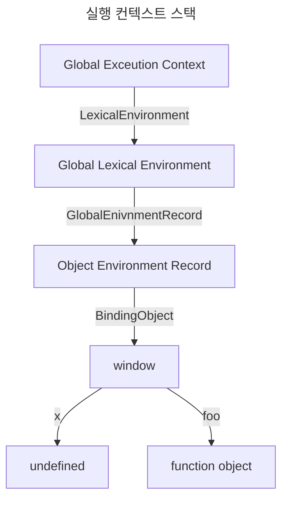
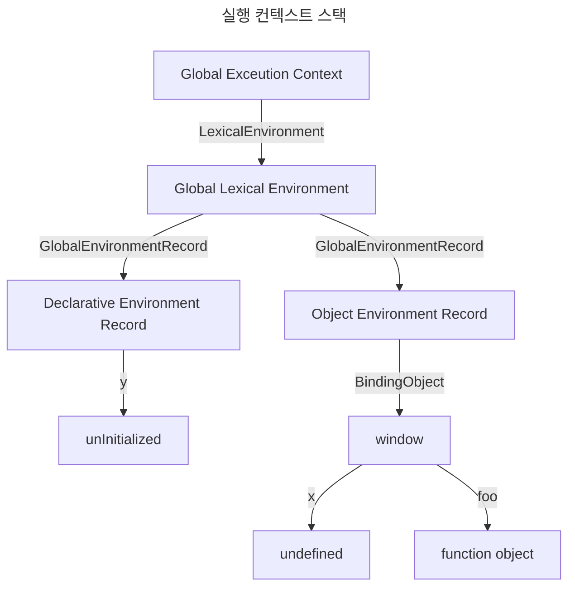
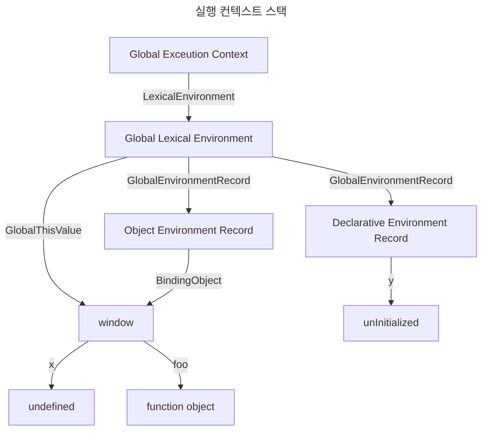
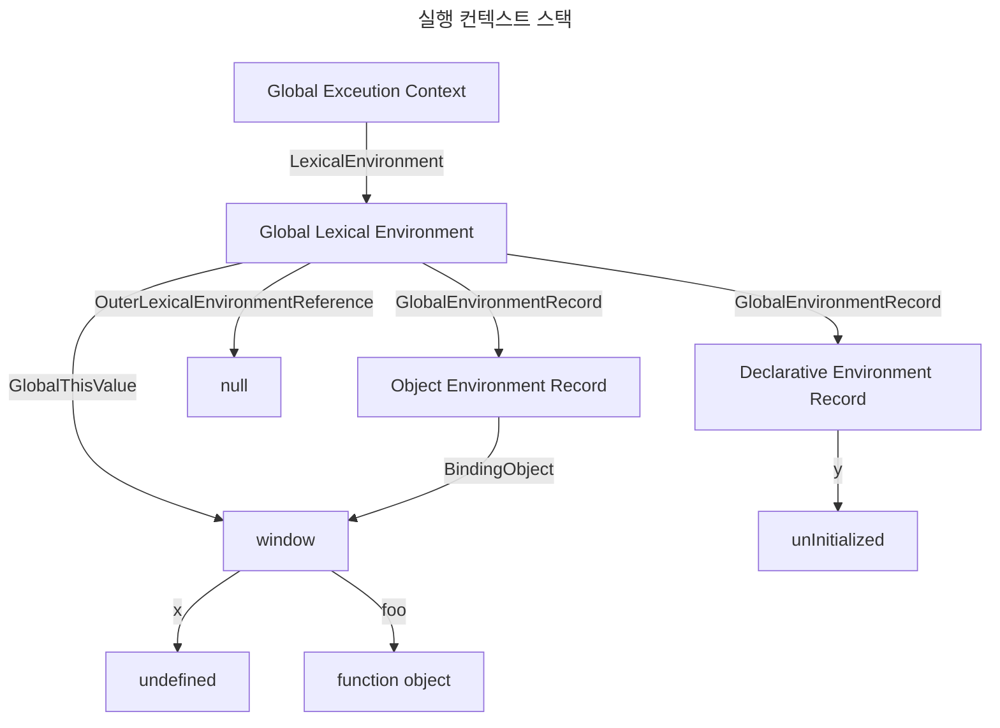
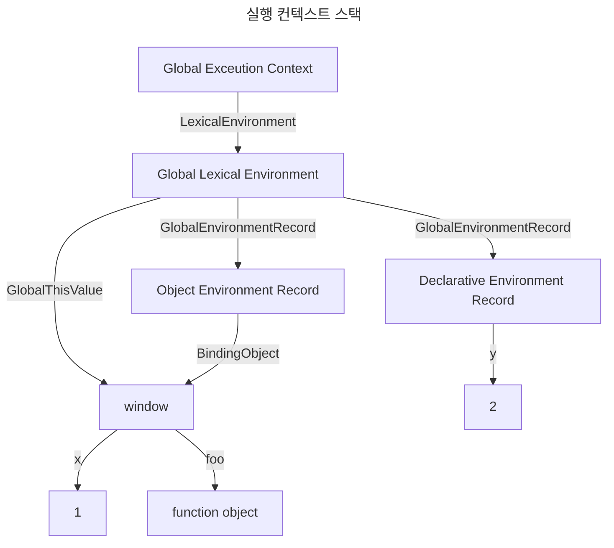
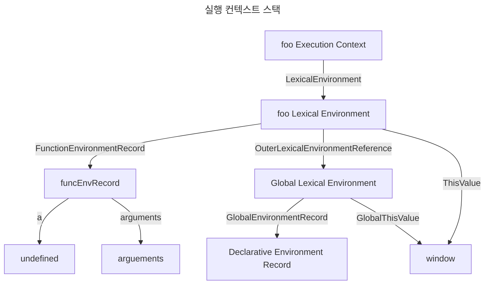
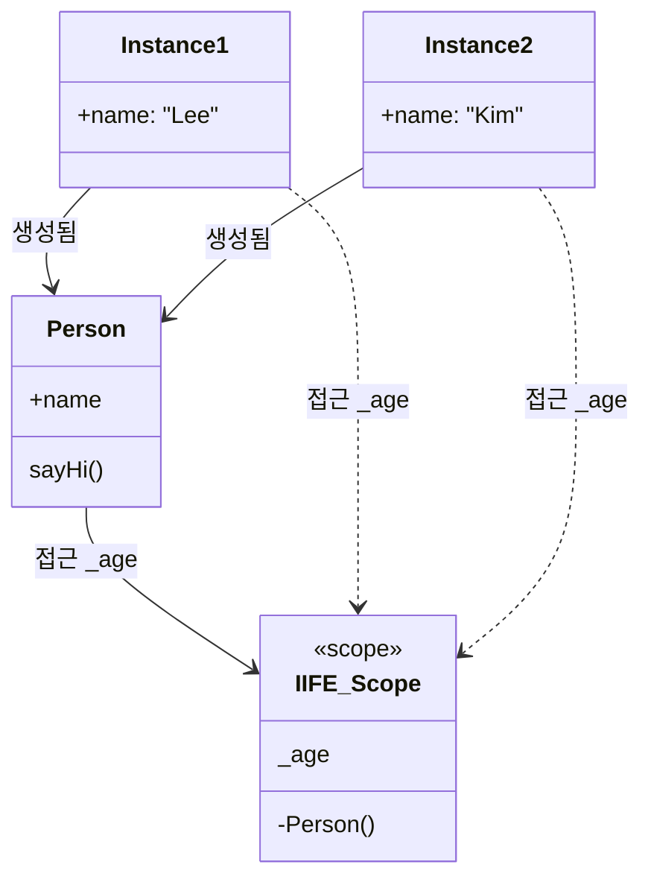

# 23장: 실행 컨텍스트
> JS 엔진의 모든 것을 관통하는 개념 
## 23.1 소스코드의 타입

- ECMAScript 사양은 소스코드를 4가지 타입으로 구분한다.

| 소스코드의 타입 | 설명 |
| ---- | ---- |
| 전역 코드(Global Code) | 전역에 존재하는 소스 코드, 전역에 정의된 함수, 클래스 등은 포함되지 않는다? |
| 함수 코드(Function Code) | 함수 내부에 존재하는 소스코드, 내부에 중첩된 함수, 클래스 등의 내부 코드는 포함되지 않는다. |
| eval 코드(Eval Code) | `eval` 함수의 인수로 전달되어 실행되는 소스코드 |
| 모듈 코드(Module Code) | 모듈 내부에 존재하는 소스코드, 모듈 내부의 함수, 클래스 등의 내부 코드는 포함되지 않는다. |
- 4가지 **소스코드 타입은 실행 컨텍스트를 생성**한다.
	- 구분하는 이유는 타입에 따라 생성하는 과정과 관리 내용이 다르기 때문이다. 

1. 전역 코드 
	1. 전역 변수를 관리하기 위해 **전역 스코프를 생성**
	2. 전역 변수, 전역 함수를 **전역 객체의 프로퍼티와 메소드로 바인딩**
2. 함수 코드
	1. **지역 스코프를 생성**하고, **지역 변수, 매개변수, arguements 객체**를 관리
	2. **생성한 지역 스코프**를 전역 스코프에서 시작하는 **스코프 체인에 연결**
3. `eval` 코드
	1. `strict mode`에서 **독자적인 스코프를 생성**
4. 모듈 코드
	1. **모듈별 독립적인 모듈 스코프를 생성**
## 23.2 소스코드의 평가와 실행
- JS 엔진은 소스코드를 **평가**와 **실행**, 2개의 과정으로 나누어 실행
	- 소스코드 평가 
		- 실행 컨텍스트 생성
		- 변수/함수 등의 선언문 실행 후 **식별자들을 스코프에 등록** 
	- 소스코드 실행 (런타임)
		- 소스코드 실행에 필요한 변수/함수의 참조를 스코프에서 검색
		- 소스코드의 **실행 결과는 스코프에 등록** 

- 스코프 : **실행 컨텍스트가 관리하는 스코프** 
## 23.3 실행 컨텍스트의 역할

``` javascript 
// 전역 변수 선언
const x = 1;
const y = 2;

// 함수 정의
function foo(a) {
	// 지역 변수 선언
	const x = 10;
	const y = 20;
	// 메서드 호출
	console.log(a + x + y); // 130
}

// 함수 호출
foo(100);

// 메서드 호출
console.log(x + y); // 3
```

1. 전역 코드 평가 
	1. **전역에 선언된 선언문(변수, 함수)**를 먼저 실행 
2. 전역 코드 실행 
	1. 전역 코드가 순차적으로 **실행**
	2. 함수가 호출되면 함수 코드로 JMP
3. 함수 코드 평가
	1. 함수 호출에 의해 **함수 내부의 매개변수, arguments, 선언문(변수, 함수)**를 먼저 실행 
	2. 평가된 내용은 **지역 스코프에 등록**되고 **`this` 바인딩** 또한 결정됨 
4. 함수 코드 실행 
	1. 함수 코드를 순차적으로 실행 
	2. `console.log` 메소드 호출 
		1. `console` 을 스코프 체인을 통해 검색 
		2. `log` 메소드를 `console` 객체의 프로토타입 체인을 통해 검색 
		3. 인수로 전달된 `a + x + y` 또한 스코프 체인을 통해 검색 후 평가 


- 실행 컨텍스트는 이 모든 과정을 관리 
	- 식별자와 스코프는 **렉시컬 환경으로 관리**
	- 코드 실행 순서는 **실행 컨텍스트 스택으로 관리**
## 23.4 실행 컨텍스트 스택
- 함수 실행에 따른 스택의 변화를 의미함. 
- 타 언어의 스택과 다르게 지역 변수의 해제가 스택의 해제와 함께 된다는 것을 보장할 수 없음.
## 23.5 렉시컬 환경
- 스코프와 식별자를 관리하는 환경 


- 렉시컬 환경은, **키와 값을 갖는 객체 형태의 스코프를 생성하여 관리**한다. 
- 식별자를 등록하고 관리하는 저장소 역할을 하는 **렉시컬 스코프의 실체**

- 실행 컨텍스트는 `LexicalEnvironment`와 `VariableEnvironment` 컴포넌트로 구성된다.

- 생성 초기에 하나의 동일한 렉시컬 환경을 참조하고 있지만, 이후 몇 가지 상황을 만나면 다른 환경을 참조하게 된다. 
	- try/catch, strict mode, eval 등이 있지만, **고려하지 않는다.** 

- 렉시컬 환경은 다음과 같이 두 개의 컴포넌트로 구성된다. 


- 환경 레코드(`EnvironmentRecord`) : 식별자에 바인딩된 값을 관리하는 저장소 
- 외부 렉시컬 환경에 대한 참조(`OuterLexicalEnvironmentReference`) : 상위 스코프
	- 외부, 상위 코드의 렉시컬 환경 
	- 참조를 통해 단방향 링크드 리스트인 **스코프 체인을 구현**

## 23.6 실행 컨텍스트의 생성과 식별자 검색 과정

이 예시를 통해 설명하니까 외워보자. 
``` javascript
var x = 1;
const y = 2;
function foo (a) {
	var x = 3;
	const y = 4;
	function bar (b) {
		const z = 5;
		console.log(a + b + x + y + z);
	}
	bar(10);
}

foo(20); // 42
```
### 23.6.1 전역 객체 생성

- 전역 객체는 전역 코드가 평가되기 이전에 생성된다. 
	- **빌트인** 전역 프로퍼티, 전역 함수, 객체 등이 추가된다. 
	- 동작 환경에 따라, **호스트 객체**(Web API 등)도 추가된다.
	- `Object.prototype` 을 상속받는다. 

### 23.6.2 전역 코드 평가

### 1. 전역 실행 컨텍스트 생성
- 전역 실행 컨텍스트를 실행 후, 실행 컨택스트에 추가한다. 


- 실행 컨텍스트 스택은 **LexicalEnvironment** 을 컴포넌트로 가진다는 것을 명심하자

### 2. 전역 렉시컬 환경 생성 
- 전역 렉시컬 환경을 생성하고 이를 전역 실행 컨텍스트에 바인딩합니다. 


- 렉시컬 환경은 `EnvironmentRecord` 와 `OuterLexicalEnvironmentReference` 를 가진다는 것을 명심하자. 
#### 2.1 전역 환경 레코드 생성
- 전역 렉시컬 환경에서 사용할 수 있는 환경 레코드를 생성한다. 
	- 전역 환경 레코드는, 전역 변수, 스코프, 빌트인 전역 함수 등을 관리한다. 
	- ES6을 지나오게 되면서, `let/const` 와 `var` 의 동작 과정이 달라지게 된다. ([[15. let, const 키워드와 블록 레벨 스코프#15.2 let 키워드|전역 객체와 let]] )
		- 전역 환경 레코드는 이를 구분하기 위해 2가지의 세부 레코드로 이루어지게 된다.
			- 객체 환경 레코드(`Object Environment Record`) :  `var` 키워드 포함, 전역 변수와 함수 선언문
			- 선언적 환경 레코드(`Declarative Environment Record`) : `let/const`로 선언한 전역 변수
##### 2.1.1 객체 환경 레코드 생성 
- 객체 환경 레코드의 관리 대상(`var`, 함수 선언문 등) `BindingObject`를 통해 전역 객체의 프로퍼티와 메소드가 된다.

``` javascript
var x = 1;
const y = 2;
function foo(a) {}
```

- `var` 변수는 선언과 초기화가 동시에 일어나기 때문에 `undefined` 가 동시에 일어난다. ([[4. 변수#4.4 변수 선언의 실행 시점과 변수 호이스팅|변수 호이스팅]])
- 함수 또한 동일한 이름의 식별자를 키로 등록하고 함수 객체를 할당한다. ([[12. 함수#12.4 함수 정의#12.4.3 함수 생성 시점과 함수 호이스팅|함수 호이스팅]])



##### 2.1.2 선언적 환경 레코드 생성 
- `let/const` 키워드는 선언적 환경 레코드에 등록되고 관리된다
	- 하지만 선언과 초기화 단계가 분리되어 일어나기 때문에 [[15. let, const 키워드와 블록 레벨 스코프#15.2.3 (let) 변수 호이스팅|일시적 사각지대]]에 빠진다. 

### 2.2 this 바인딩 
- 생성한 글로벌 환경 레코드의 \[\[GlobalThisValue]] 내부 슬롯에 `this`가 바인딩 된다. 
	- 일반적으로 `this` 는 전역 객체를 가리키기 때문에, `window` 가 된다.

### 2.3 외부 렉시컬 환경에 대한 참조 결정 
- 현재 평가중인 소스코드는 전역 코드이기 때문에 외부 렉시컬은 `null` 이다. 

### 23.6.3 전역 코드 실행
- 값들이 실제로 할당되기 시작한다. 


- 식별자 결정을 위해 실행 컨텍스트에서 찾기 시작한다. 
	- 실행 컨텍스트에서(현재는 전역 컨텍스트) 식별자들을 탐색하고 없는 경우 `OuterLexicalEnvironmentReference` 으로 탐색을 이어가게 된다. 
### 23.6.4 foo 함수 코드 평가
- 실행 컨텍스트가 `foo` 로 넘어각 ㅔ되고, `foo` 에 대한 평가가 시작된다.
	- 평가 과정은 전역 코드 평가와 유사하다.
- `this` 는 전역 객체의 `window` 로 향하게 된다. 
- 함수는 호출 위치보다 정의된 위치에 따라 상위 스코프를 결정한다, [[13. 스코프#13.5 렉시컬 스코프|렉시컬 스코프]] 
	- 함수가 평가될때, **함수 객체 내부의 `[[Environment]]` 에 실행중인 실행 컨텍스트의 렉시컬 환경을 등록**한다. 

### 23.6.5 foo 함수 코드 실행
- 식별자 결정을 위해, `[[EnvironmentRecord]]` 를 탐색하고, 없는경우 `[[OuterLexicalEnvironmentReference]]` 로 탐색을 이어간다.
### 23.6.6 bar 함수 코드 평가
### 23.6.7 bar 함수 코드 실행


- `console` 객체는, `bar Lexical Environment` 에서 `Global Lexical Environemnt` 로 탐색을 이어가게 되고, `window` 전역 객체에서 찾게 된다. 
	- `log` 함수는 `console` 객체의 프로토타입 체인을 통해 메소드를 검색한다. 
### 23.6.8 bar 함수 코드 실행 종료
- `bar` 함수 코드가 실행이 종료되더라도, 렉시컬 환경이 즉시 소멸하지는 않는다. 
	- **누군가에 의해 참조되지 않을 때, 비로소 소멸된다.**
### 23.6.9 foo 함수 코드 실행 종료
### 23.6.10 전역 코드 실행 종료
## 23.7 실행 컨텍스트와 블록 레벨 스코프
- `let/const` 변수들은 블록 레벨 스코프를 갖게된다. 
	- 실행 컨텍스트는 블록이 실행됨에 있어 새로운 블록 스코프를 생성하게 된다.


# 24. 클로저 
> 클로저는 함수와 그 함수가 선언된 렉시컬 환경과의 조합이다. 

## 24.1 렉시컬 스코프 
- [[13. 스코프#13. 스코프#13.5 렉시컬 스코프|렉시컬 스코프]] : 어디서 호출했는 지가 아니라, 어디에 정의했는 지에 따라 상위 스코프를 결정 

## 24.2 함수 객체의 내부 슬롯 `[[Environment]]`
- `[[Environment]]`: 함수가 자신의 상위 스코프를 저장하는 슬롯
	- 상위 스코프 : 함수가 선언된 스코프

## 24.3 클로저와 렉시컬 환경 
- 클로저 : 외부 함수보다 **중첩 함수가 더 오래 유지되는 중첩 함수** 
	- 관례적으로, 중첩 함수가 **외부 함수의 일부 식별자를 참조**하는 경우를 특정
		- 모던 브라우저는, 참조하는 외부 함수의 식별자만을 유지하도록 최적화.

- 클로저 : 함수가 **자유 변수에 닫혀 있다.**
	- **자유 변수**: 클로저에 의해 참조되는 **상위 스코프의 변수** 
		- 기존의 스코프와 다르게 자유롭게 참조될 수 있기 때문에 
	- **닫혀 있다** : 특정 스코프의 변수들과 함께 묶여있다.


- 외부 함수가 삭제되더라도 **중첩 함수의 렉시컬 환경은 남아있음.**


## 24.4 클로저의 활용 
- 클로저는 **상태를 안전하게 변경하고 유지**하기 위해 사용된다
	- 상태를 안전하게 은닉하고, 특정 함수에게만 상태 변경을 허용한다. 
``` javascript 
// 일반 구현 -> num에 접근을 제한할 수 없음 
let num = 0;

const increase = function () {
	return ++num; 
}

// Closure의 구현 -> num에 접근을 할 수 없음
const increase = function () {
	let num = 0; 

	return function () {
		return ++num;
	}
}
```

## 24.5 캡슐화와 정보 은닉 
- **캡슐화** : 프로퍼티와 프로퍼티의 동작인 메소드를 하나로 묶는 것.
	- 프로퍼티나 메소드 감출 목적으로 사용되기도 함 -> **정보 은닉**

- 클로저를 이용해 정보 은닉을 **흉내**낼 수 있다. ([[12. 함수#12.7.1 즉시 실행 함수 (IIFE)|IIFE]])
``` javascript
// public age
function Person(name, age) {
	this.name = name;
	this.age = age;
	this.sayHi()  = function () {
		console.log(`name : ${name}, age : ${age}`)
	}
}

// private age 
function Person(name, age) {
	this.name = name; 
	let _age = age; 
	this.sayHi = function () {
		console.log(`name : ${name}, age : ${_age}`)
	}
}

// 인스턴스 메소드 -> 프로포토타입의 메소드 
function Person(name, age) {
	this.name = name;
	let _age = age;
}

Person.prototype.sayHi = function () {
	// _age 를 참조할 수가 없음.. 
	console.log(`name : ${name}, age : ${_age}`)
}

// IIFE + 클로저를 이용한 프로토타입 메소드 
const Person = (function() {
	let _age = 0;

	function Person(name, age) {
		this.name = name;
		_age = age;
	}
	
	Person.prototype.sayHi = function () {
		console.log(`name : ${name}, age : ${_age}`)
	}

	return Person
}());

// 근데 같은 변수(_age)를 공유하기 때문에 side effect가 발생할 수 있음 
const me = new Person('Lee', 20);
const you = new Person('Kim', 30);

me.sayHi(); // name : Lee, age : 30
```

- 서로 다른 클로저처럼 보이지만, 왜 같은 공간을 참조하는가? 
	- `Person.prototype.sayHi` 가 **단 한 번 생성되는 클로저** 이기 때문이다. 
		- IIFE가 호출될 때 생성되는데, 모든 `sayHi`의 상위 스코프가 IFFE로 고정된다. 
		- IIFE Context를 공유하기 때문에 여러 인스턴스가 생성되어도 상위 스코프를 공유하게 된다. 


- 그래서, 곧 도입될(도입된?) `private` 를 쓰자! 
## 24.6 자주 발생하는 실수 
- 클로저보다 `var` 의 문제같긴 한데요.
``` javascript
var funcs = [];

// WA, var는 함수 레벨 스코프기 때문에 동일한 변수를 참조하게 된다
for (var i = 0; 1 < 3; i++) {
	funcs[i] = function () { return i; }; 
｝

for (var j = 0; j < funcs. length; j++) {
	console.log(funcs[j]()); // 모두 3 
}

// 상위 스코프를 전역에서 IIFE로 변경하면 해결할 수 있다. 
for (var i = 0; i < 3; i++) {
	funcs[i] = (function (x) {
		return function () {
			return x; 
		}
	})(i)); 
}

// let 쓰면 놀랍게 해결이 가능한데, 블록 스코프는 매 실행마다 렉시컬 환경을 새로 생성한다. 
for(let i = 0; i < 3; i++) {
	funcs[i] = function () { return i; }
}

// 함수형 프로그래밍은 변수와 반복문의 사용을 억제하기 때문에 오류를 줄일 수 있다
const funcs = Array.from(new Array(3), (_, i) => () => i); 
funcs.forEach(f => console.log(f())); 
```


# 25. 클래스 

## 25.1 클래스는 [[19. 프로토타입|프로토타입]]의 문법적 설탕인가?
- 클래스는, 객체지향 프로그래밍에 익숙한 프로그래머가 더욱 빠르게 학습할 수 있도록 하는 **프로토타입의 문법적 설탕**이라고 볼 수 있다.
	- 생성자 함수와 클래스는 완전히 동일하지 않지만 **유사하다.**
		- 클래스는 반드시 `new` 연산자와 함께 호출되어야 한다.
		- 상속을 지원하는 `extends`와 `super` 키워드를 제공한다. 
		- 클래스는 호이스팅이 발생하지 않는 것처럼 동작한다. 
		- 클래스 내의 모든 코드는 암묵적으로 [[20. strict mode|strict mode]]이다. 
		- 클래스의 프로퍼티의 `[[Enumerable]]` 는 `false` 이다. 

## 25.2 클래스 정의
- 선언문
``` javascript
class Person {}
```

- 표현식 ([[18. 함수와 일급 객체#18.1 일급 객체|일급 객체]]라는 것을 의미 )
``` javascript
const Person = class {}; 
const Person = class MyClass {}; 
```


## 25.3 클래스 호이스팅
- **클래스는 함수로 평가된다.**
	- 평가되어 생성하는 시점에 **생성자와 그 프로토타입이 더불어 생성**된다. 
``` javascript
class Person {} 

console.log(typeof Person); // function
```

- 근데, 참조는 불가능하다.
``` javascript
console.log(Person); // ReferenceError

class Person {};
```

- 아무튼, 호이스팅은 발생한다.
	- [[15. let, const 키워드와 블록 레벨 스코프#15.2.3 (let) 변수 호이스팅|let/const 호이스팅]] 처럼 동작한다. 
``` javascript 
const Person = ''; 

{
	console.log(Person); // ReferenceError : 호이스팅이 발생한다는 의미 
	class Person {}
}
```
## 25.4 인스턴스 생성
- `new` 연산자와 함께 **호출해야 한다.**
``` javascript
class Person {} 

const me = new Person();
console.log(me); // Person {}
```

- 표현식의 경우, 표현식의 식별자를 이용해 생성해야 한다.
``` javascript
const Person = class MyClass {};

const me = new Person(); 

console.log(MyClass) // ReferenceError 
const you = new MyClass(); // Reference Error 

console.log(me); // MyClass {} 

// 무명 표현식인 경우?
const Person = class {};
console.log(new Person()); // Person {}
```
## 25.5 메소드

- 클래스에서 정의 할 수 있는 메소드는 세 가지의 종류가 있다.
	- constructor 
	- 프로토타입 메소드
	- 정적 메소드
### 25.5.1 constructor

- **생성하고 초기화하기 위한 특수한 메소드**
``` javascript 
class Person {
	constructor(name) {
		this.name = name; 
	}
}
```

- Prototype 으로 이해하는 생성자 함수
`console.dir(Person)` 으로 `Person` 클래스의 프로토타입을 살펴보면, 프**로토타입의 생성자가 `class Person` 을 가리키고 있음을 확인**할 수 있다. 이는 **클래스**가 인스턴스를 생성하는 **생성자 함수**라는 것을 의미한다. 

- 클래스의 `constructor` 는 프로토타입의 `constructor`가 아니다. ([[19. 프로토타입#19.3.3 프로토타입의 constructor 프로퍼티와 생성자 함수|프로토타입의 constructor]])
	- 프로토타입의 `constructor`  : 생성자 함수를 가리키는 프로퍼티 
	- 클래스의 `constructor` : 인스턴스 생성시 초기화하기 위해 사용되는 특수한 메소드
		- 함수 객체 코드의 일부가 되어 인스턴스 생성시 `constructor` 내부에 명세된 코드를 수행하게 됨. 

- 2개 이상의 `constructor` 메소드는 있을 수 없다. 
- `constructor`는 생략할 수 있다. 
	- 암묵적으로 정의된 `constructor`가 생성됨.
- `constructor` 내부에서 인스턴스 프로퍼티를 추가할 수 있다. 
 
### 25.5.2 프로토타입 메소드
- 모든 메소드 정의는 프로토타입 메소드로 평가된다.
- 인스턴스는 [[19. 프로토타입#19.7 프로토타입 체인|프로토타입 체인]]의 일원으로 평가된다.
- 결국, 클래스는 프로토타입 기반의 객체 생성 메커니즘이다. 

### 25.5.3 정적 메소드
- `static` 키워드를 통해 정적 메소드로 사용할 수 있다.

### 25.5.4 정적 메소드와 프로토타입 메소드의 차이
- 정적 메소드 : `this` 가 클래스를 가리킴
- 프로토타입 메소드 : `this` 가 인스턴스를 가리킴

### 25.5.5 클래스에서 정의한 메서드의 특징
- 클래스는 반드시 `new` 연산자와 함께 호출되어야 한다.
- 상속을 지원하는 `extends`와 `super` 키워드를 제공한다. 
- 클래스는 호이스팅이 발생하지 않는 것처럼 동작한다. 
- 클래스 내의 모든 코드는 암묵적으로 [[20. strict mode|strict mode]]이다. 
- 클래스의 프로퍼티의 `[[Enumerable]]` 는 `false` 이다. 

## 25.6 클래스의 인스턴스 생성 과정
- [[17. 생성자 함수에 의한 객체 생성#17.2.3 생성자 함수의 인스턴스 생성 과정|생성자 함수의 인스턴스 생성 과정]] 과 유사하게 생성된다. 

## 25.7 프로퍼티

### 25.7.1 인스턴스 프로퍼티
- 모든 인스턴스 프로퍼티는 `constructor` 내부에서 정의되어야 한다.

### 25.7.2 접근자 프로퍼티
- [[16. 프로퍼티 어트리뷰트#16.3.2 접근자 프로퍼티|접근자 프로퍼티]] 를 클래스에서도 생성할 수 있다.
	- 내부적으로 `setter`와 `getter` 를 사용하기 때문에 프로토타입 프로퍼티이다.
``` javascript
class Person {
	constructor (firstName, lastName) {
		this.firstName = firstName;
		this.lastName = lastName;
	}
	
	// fultName은 접근자 함수로 구성된 접근자 프로퍼티다.
	// getter 함수
	get fullName {
		return `${this.firstName} ${this.lastName}`;
	}
	
	// setter 함수
	set fullName (name) {
		[this.firstName, this.lastName] = name.split(' ');
	}
}

const me = new Person('first', 'last')
console.log(me.fullName) // first, last

me.fullName = 'Hello World'
```
### 25.7.3 클래스 필드 정의 제안
- 이게 불법이었다니
	- ECMAScript의 정식 표준 사양은 아니지만, 제안되어 있다. 
	- 최신 브라우저(크롬 72)와 노드(버전 12)에서는 선제적으로 구현해놓았다.
``` javascript
class Person  {
	name = 'Lee';
}
```

### 25.7.4 private 필드 정의 제안
- `private`을 클로저로 유사하게 흉내낼 수 있지만 완전하지 않다 ([[24. 클로저#24.5 캡슐화와 정보 은닉|정보 은닉 - 클로저]])
- 이 또한 ECMAScript 정식 표준 사양은 아니지만, 제안되어 있다.
- 최신 브라우저(크롬 74)와 노드(버전 12)에서는 선제적으로 구현해놓았다.

- `#` 식별자를 통해 `private`을 구현현할 수 있다.
``` javascript
class Person {
	#name = ''; // private field

	constructor(name) {
		this.#name = name;
	}
}
```

- `private` 필드는 반드시 몸체에 정의 되어야 한다.

### 25.7.5 static 필드 정의 제안
- `static` 도 `private`으로 선언될 수 있다. 

## 25.8 상속에 의한 클래스 확장

### 25.8.1 클래스 상속과 생성자 함수 상속
- 클래스 상속 : `extends` 를 통하여 클래스 상속이 가능하다. 
- 생성자 함수 상속 : `prototype` 과 `constructor` 조작을 통한 상속

### 25.8.2 extends 키워드

### 25.8.3 동적 상속
- `extends` 는 생성자 함수를 상속받아 클래스를 확장할 수 있다. 
``` javascript
function Base(a) {
	this.a = a;
}

class Derived extends Base {}
```

- 이를 통해 동적으로 상속받을 대상을 결정할 수 있다`
``` javascript
function Base1() {}
class Base2 {} 

let condition = true; 

// ㄷㄷ
class Derived extends (condition ? Base1 : Base2) {}
```

### 25.8.4 서브클래스의 constructor
- 서브클래스에서 `constructor`가 생략되면 암묵적인 생성자가 정의된다. 
``` javascript
constructor(..args) { super(...args) }
```
### 25.8.5 super 키워드
- 함수처럼 호출도 가능하고, `this` 처럼 사용할 수도 있는 특수한 키워드다. 
	- 호출 : `super` 클래스의 `constructor` 를 호출한다.
	- 참조 : `super` 클래스의 메소드를 호출할 수 있다. 
``` javascript
// super를 참조하는 경우, 아래와 같은 의미를 가지게 된다. 
const _super = Object.getPrototypeOf(Derived.prototype);
```


- `super`는 자신을 바인딩하고 있는 객체를 가리킨다
- `super = Object.getPrototypeOf([[HomeObject]])` , 
	- `[[HomeOjbect]]` : 메소드 축약 표현으로 생성할 때 설정되는 내부 슬롯 		
		- `[[HomeObject]]` 는 반드시 **메소드 축약 표현으로 정의된 함수만이 갖는다**
	- `[[HomeObject]]` 의 값: 메소드가 속한 객체

``` javascript
const obj = {
	foo() {}, 
	// 메소드 축약 표현이 아님, [[HomeObject]]를 갖지 않는다, super 호출이 제한된다.
	bar: function() {} 
}
```

- `Class`만이 사용가능한 키워드는 아니다, 객체 리터럴 간 상속시에도 사용이 가능하다.
``` javascript
const base = {
	name: 'Lee',
	sayHi() {
		return Hi! ${this.name}
	｝
};

const derived = {
	__proto__: base,
	// ES6 메서드 축약 표현으로 정의한 메서드다. 따라서 [[Homeobject ]]를 갖는다.
	sayHi() {
		return ${super.sayHi()}. how are you doing?™
	}
}
```

- 메소드 축약 표현으로 정의되지 않은 메소드는, **상속 받아 사용할 수는 있지만 `super` 참조가 되지 않는다.**
### 25.8.6 상속 클래스의 인스턴스 생성 과정
``` javascript 
class A {
	constructor(name) {
		this.name = name; 
	}
}

class B extends A {
	constructor(name, age) {
		super(name)
		this.age = age;
	}
}
```

1. `new B()` 실행시 `new A()`가 실행된다.
	- `super(name)` 을 통하여 `new A()` 가 실행되게 된다. 
		- 이 때 [[17. 생성자 함수에 의한 객체 생성#17.2.7 new.target|new.target]] 이 가리키는 것은 `A`가 아니라 `B`다. 
			- 내부 슬롯 `[[ConstructorKind]]` 의 값(`base`/`derived`)을 조건으로 동작하게 된다. 
2. `new A()` 가 실행이 끝나게 되면 반환된 `this`를 바인딩하고 `new B()`의 초기화 로직을 실행하게 된다.
- 따라서, `super()` 를 먼저 호출하지 않으면 생성자 로직을 수행할 수 없다.
### 25.8.7 표준 빌트인 생성자 함수 확장
 - 빌트인 된 객체의 동작을 확장하여 변경하려면 어떻게 해야할까? 
``` javascript 
// Array 생성자 함수를 상속받아 확장한 MyArray
class MyArray extends Array {
	// 중복된 배열 요소를 제거하고 반환한다: [1, 1, 2, 3] => [1, 2, 3]
	uniq() {
		return this.filter((v, i, self) => self.indexOf(v) === i;
	);

	// 모든 배열 요소의 평균을 구한다: [1, 2, 3]=> 2
	average () {
		return this.reduce((pre, cur) => pre + cur, 0) / this.length;
	}
}
```

- 위의 객체는, 메소드 체이닝 과정에서 `Array` 가 아닌 `MyArray`를 반환한다.
- `Array` 반환하게 하려면 다음과 같이 정적 접근자 프로퍼티를 추가하면 된다..? 
``` javascript 
// Array 생성자 함수를 상속받아 확장한 MyArray
class MyArray extends Array {
	static get [Symbol.species]() { return Array; }

	// 중복된 배열 요소를 제거하고 반환한다: [1, 1, 2, 3] => [1, 2, 3]
	uniq() {
		return this.filter((v, i, self) => self.indexOf(v) === i;
	);

	// 모든 배열 요소의 평균을 구한다: [1, 2, 3]=> 2
	average () {
		return this.reduce((pre, cur) => pre + cur, 0) / this.length;
	}
}
```
